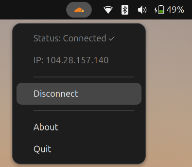

# WARP Indicator

[](https://opensource.org/licenses/MIT)
[](https://www.python.org/)
[](https://kernel.org/)
[](https://github.com/CoderAni34/warp-indicator/releases)

A lightweight native GTK system tray indicator for Cloudflare WARP on Linux.

WARP Indicator provides quick access to connect/disconnect WARP, monitor connection status, and view your public IP directly from the system tray using AppIndicator.

---

# Features

* Native GTK/AppIndicator integration
* Connect/disconnect WARP directly from tray
* Real-time WARP status updates
* Public IP display
* Lightweight and minimal resource usage
* Auto-start support
* Debian package support (`.deb`)
* Self-contained icon assets (independent from Cloudflare updates)

---

# Screenshots

## Connected



## Disconnected


---

# Requirements

* Linux (Ubuntu/GNOME recommended)
* Python 3.6+
* Cloudflare WARP installed
* `warp-cli` available in PATH

Required packages:

```bash
python3
python3-gi
gir1.2-appindicator3-0.1
gir1.2-gtk-3.0
python3-requests
cloudflare-warp
```

---

# Installation

## Install Dependencies

### Ubuntu / Debian

```bash
sudo apt update

sudo apt install -y \
python3 \
python3-gi \
python3-requests \
gir1.2-appindicator3-0.1 \
gir1.2-gtk-3.0 \
cloudflare-warp
```

---

# Download

Download the latest `.deb` package from the Releases page:

[WARP Indicator Releases](https://github.com/CoderAni34/warp-indicator/releases?utm_source=chatgpt.com)

---

# Install Package

```bash
sudo dpkg -i warp-indicator_1.1-1.deb
sudo apt -f install
```

---

# Usage

Launch manually:

```bash
warp-indicator
```

or:

```bash
python3 warp-indicator.py
```

The indicator will appear in the system tray.

From the tray menu you can:

* View WARP connection state
* View current public IP
* Connect/disconnect WARP
* Open About dialog
* Quit the application

---

# Auto-start

The Debian package installs an autostart entry automatically.

After login, WARP Indicator should launch automatically in supported desktop environments.

---

# Important Notes

## Official Cloudflare Tray Conflict

Cloudflare WARP ships with its own tray application:

```text
warp-taskbar
```

Running both applications simultaneously may cause duplicate tray icons.

If duplicate icons appear, disable the official tray service:

```bash
systemctl --user disable warp-taskbar.service
systemctl --user stop warp-taskbar.service
systemctl --user mask warp-taskbar.service
```

This does NOT disable:

```text
warp-svc
```

which is still required for WARP functionality.

---

# Project Structure

```text
warp-indicator/
├── assets/
│   └── icons/
├── debian/
├── screenshots/
├── LICENSE
├── README.md
├── build.sh
├── requirements.txt
└── warp-indicator.py
```

---

# Building From Source

Clone repository:

```bash
git clone https://github.com/CoderAni34/warp-indicator.git
cd warp-indicator
```

Run build script:

```bash
chmod +x build.sh
./build.sh
```

The generated `.deb` package will be created in the build directory.

---

# Known Limitations

* Primarily tested on Ubuntu/GNOME
* Tray/AppIndicator behavior may vary across desktop environments
* Requires Cloudflare WARP CLI (`warp-cli`)
* Wayland support depends on desktop environment AppIndicator compatibility

---

# Contributing

Pull requests, bug reports, and improvements are welcome.

If you encounter issues:

* Open an issue
* Include logs/screenshots
* Mention your Linux distribution and desktop environment

---

# License

This project is licensed under the MIT License.

See the `LICENSE` file for details.

---

# Acknowledgements

* [Cloudflare WARP](https://warp.com/?utm_source=chatgpt.com)
* [GNOME Project](https://www.gnome.org/?utm_source=chatgpt.com)
* [Python](https://www.python.org/?utm_source=chatgpt.com)

---

Made by [CoderAni34](https://github.com/CoderAni34?utm_source=chatgpt.com)
